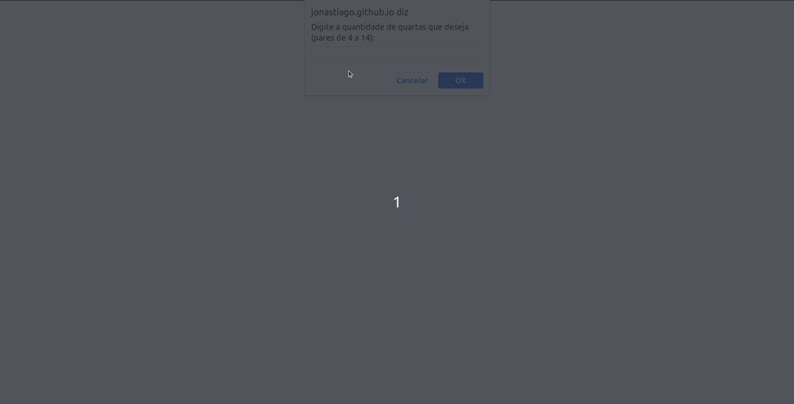

# Jogo da Memoria

Esse projeto consiste em um belo jogo da memoria com cartas, desenvolvida com html, css e javascript.

## Demonstração

<p aling="center">
  
</p>

## Rodando localmente

Clone o projeto

1. Clone o projeto

```bash
  git clone git@github.com:JonasTiago/parrotscardgame.git
```

2. Entre no diretório do projeto

```bash
  cd parrotscardgame
```

## Stack utilizada

**Front-end:** js, html, css